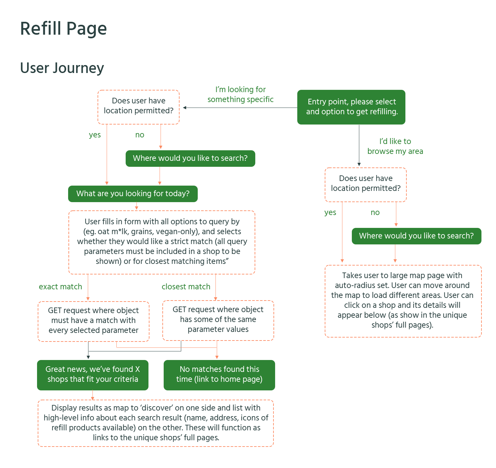
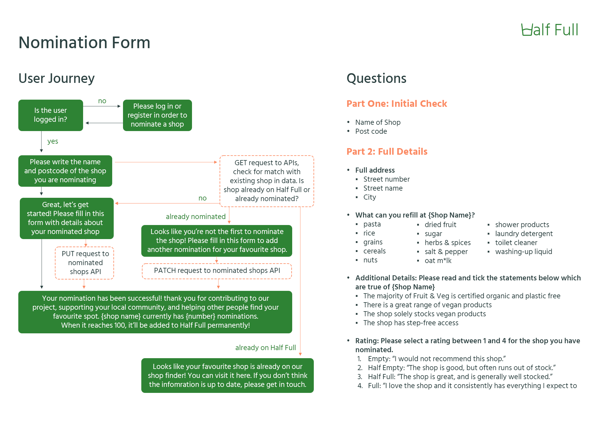
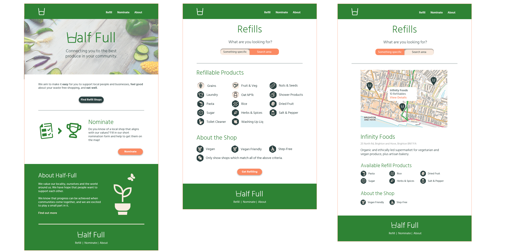
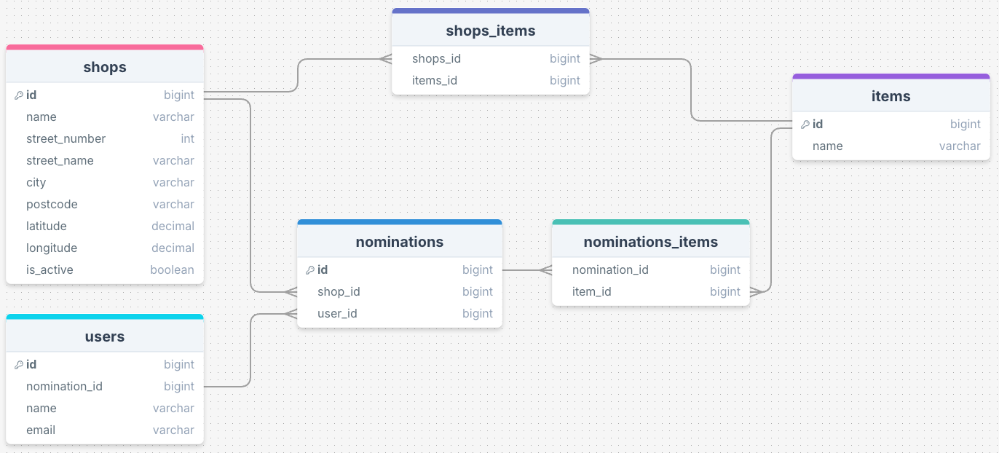
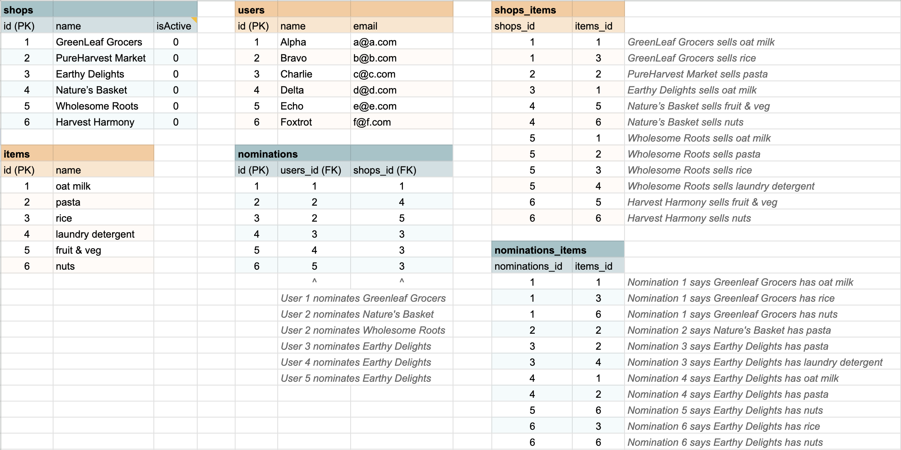

**Please note**, this is a work in progress. The site is being created as a 'Capstone' project, as part of a BrainStation Software Engineering Bootcamp. [The Server Repo can be found here](https://github.com/effie-fow/half-full-refills-server).

To view the live web application, please visit [www.halffullrefills.com](https://www.halffullrefills.com).

# Half-Full Refills

## Overview

**Half Full** refills is the modest store locator connecting you to the best produce and products in your community. We aim to make it easy to support local people and businesses, feel good about your waste-free shopping, and eat well.

### Problem Space

Articulated well by [Shop Local's '10 Reasons Why'](https://shoplocaluk.org/reasons-why/), supporting local businesses recirculates money locally, preserves your community and reduces your carbon footprint.

A range of studies highlighted by [Readability](https://www.readability.co.uk/blog/sustainability-statistics-that-might-shock-you/#:~:text=76%25%20of%20consumers%20choose%20paper,over%20plastic%20for%20environmental%20reasons.) all point to the fact that the majority of UK consumers **want** to shop plastic-free, are willing to pay more for sustainable packaging and "expect brands to act sustainably". And yet, when asked 'where do you regularly buy food and products for everyday use?', 83% of UK respondents said Supermarkets, with only 10% reporting Organic Food Stores ([June 2024](https://www.statista.com/forecasts/997923/grocery-shopping-by-store-type-in-the-uk)).

So we jump to blogs, community boards and Reddit, where shopping local is "too expensive" and "time consuming". In short, people seem to agree that it is a good thing to do, but ultimately don't see sustainable shopping as a sustainable lifestyle. It's not accessible.

At **Half-Full**, we still have hope that this can change. We are not under any illusions that shopping organic and locally can be more time-consuming. But, we believe it's worth it, and believe more people would shop the way we like to if they knew where to go.

Our app celebrates and connects you to your local businesses that provide waste-free shopping. Use our simple filters to find what you're looking for, and get refilling.

Know of a local shop that aligns with our values? Fill in our short nomination form and help to get them on the map!

### User Profile

- Shoppers:
  - who already shop in refill markets
  - looking for shops in a new area
  - who are interested in starting to shop this way

### Features

- As a user, I want to browse refill and/or organic produce shops in a given area
- As a user, I want to know what products are available to refill in the shops
- As a user, I want to know if the shop is well stocked with vegan/plant-based products
- As a user, I want to know the shop has been approved by other users

- As a logged in user, I want to be able to 'nominate' shops which are already on the system
- As a logged in user, I want to be able to 'nominate' my local shop which isn't already on the system

## Implementation

### Tech Stack

- React
- Node
- Express
- MySQL
- Client libraries:
  - react
  - react-router
  - axios
  - knex
  - uuid
  - sass
  - react-dropdown

### External APIs

- MapBox
  - GL JS - _for map display_
  - Geocoding - _for finding coordinates_

### Sitemap

- Home page
- Shops

  - Shops (Browse)
    - Map feature
    - Selected shop cards appear below map
  - Shops (Search)

    - List of refill items for user to select (with strict search / must include optional)
    - Once selected, 'find shops' button brings up list of shops with icons matching your search
    - **Refill Page Plan**

    

- Nominate a Shop

  - Form page where logged in users can fill in essential details about the shop they're nominating
  - **Nomination Form Plan**

    

- Log-in
- Create account

### Mockups

### Data

There will be three core data tables with varying relationships, two intermediate tables and a user table.

1. **shops** - includes key shop details;

   - **Columns**

     - id (PK)
     - name
     - street number
     - street name
     - city
     - postcode
     - coordinates
     - is active

   - **Relationships**
     - items - N:N via intermediate
     - nominations - 1:N

   ***

2. **items** - includes item ID and item's name (eg. pasta, oat milk, laundry detergent)

   - **Columns**

     - id (PK)
     - name
     - formatted name

   - **Relationships**
     - shops - N:N via intermediate
     - nominations - N:N via intermediate

   ***

3. **nominations** - table to track the details of each nomination submitted by a user

   - **Columns**

     - id (PK)
     - shops_id (FK)
     - users_id (FK)

   - **Relationships**
     - shops - N:1
     - users - N:1
     - nominations - N:N via intermediate

   ***

4. **users** - details of logged in user

   - **Columns**

     - id (PK)
     - name
     - email
     - password (protected by JWT token / bcrypt)

   - **Relationships**
     - nominations - 1:N

   ***

   

### Endpoints

**Please note:** The Half-Full API requires an API key with all requests from the client. If cloning the repo and making your own instance of the database, this must be added to a .env file in both client/server. The key must be added to all requests as a query parameter. Example URL: http://localhost:3030/shops?api_key=your-api-key.

- **GET - /shops**

  Full list of shops - without query params, returns list of all shops on DB.

  https://halffullapi.com/shops

  - Params

    - ?match_type={"exact" or "partial"} = defines whether all items queried must be included in results, or if at least one must be included.

      - baseURL/shops?is-active=1&items=milk,grains,fruit_veg&**match_type=exact**

    - ?items={item} = finds shops by whether or not they have specific items (optional - full list of shops returned if not specified)

      - baseURL/shops?is-active=1&**items=milk,grains,fruit_veg**&match_type=exact

    - ?is_active={1 or 0} = refines list to either 'active' or 'inactive (nominated)' shops (optional - full list of shops returned if not specified)

      - baseURL/shops?**is-active=1**

    - ?city={city name} = refines list to only show shops in the named city

      - baseURL/shops?is-active=1&items=fruit_veg&**city=brighton**

    ***

  - Returns

    _Array of full shop objects_

    - [{...}, {...}, {

      - id: random-shop-id,
      - name: Shop Name,
      - address: {
        - streetNumber: 1,
        - streetName: Random Street,
        - city: City,
        - postCode: AA11 AA1,
        - latitude: 51.5072,
        - longitude: 0.1276,
      - }
      - refills: {
        - pasta: boolean,
        - rice: boolean,
        - grains: boolean,
        - nuts: boolean,
        - driedFruit: boolean,
        - sugar: boolean,
        - herbsSpices: boolean,
        - saltPepper: boolean,
        - showerProducts: boolean,
        - oatMillk: boolean,
        - laundryDetergent: boolean,
        - toiletCleanser: boolean,
        - washingUpLiquid: boolean,
      - }
      - otherInfo: {
        - fruitVeg: boolean,
        - veganAlternatives: boolean,
        - stepFreeAccess: boolean,
        - rating: number(1-4)
      - }

    - }]

---

- **GET - /shops/:id**

  Full shop object

  https://halffullapi.com/shops/:id

  - Returns

    _Full shop object of individual shop, specified by ID_

---

- **PATCH - /shops/:id**

  Edit single property of object

  - Requires req body:
    - Object containing properties to edit (e.g {is_active: 1})

  https://halffullapi.com/shops/:id

  - Returns

    _Updated shop object_

---

- **POST - /shops**

  Add new shop

  - Requires req body:
    - Object containing all shop properties (name, street_number, street_name, city, postcode, coordinates, is active)

  https://halffullapi.com/shops

  - Returns

    _New shop object including shop ID_

---

- **DELETE - /shops/:id**

Delete specified shop from database

https://halffullapi.com/shops/:id

- Returns

  _No object (204 No Content)_

---

- **GET - /items**

  Full list of items.

  https://halffullapi.com/items

  - Returns

    _Full list of items_

---

- **GET - /nominations/shops/:id/items**

  Full list of items associated with a unique nominations (i.e. Nomination with ID of 2 has five unique items associated with it. The array returned from '/nominations/shops/2/items' will have five objects in it, one for each item).

  https://halffullapi.com/nominations/shops/:id/items

  - Returns

    _List of all item IDs associated with the nomination ID_

---

- **GET - /nominations/shops/:id**

  Full list of nominations associated with a unique shop, specified by shop ID as path param.

  https://halffullapi.com/nominations/shops/:id

  - Returns

    _List of nomination objects, each associated with a shop's ID and a user's ID_

---

- **POST - /nominations/shops/:id**

  Add a unique nomination for a shop.

  - Requires req body:
    - Object containing two properties:
      - users_id: (unique user's ID)
      - items: (array of items selected when nominating shop)

  https://halffullapi.com/nominations/shops/:id

  - Returns

    _Object with the name of the shop nominated, and the full list of items selected_

---

- **DELETE - /nominations/shops/:id**

  Delete single nomination by unique nomination ID.

  https://halffullapi.com/nominations/shops/:id

  - Returns

    _No object (204 No Content)_

---

- **POST - /shops/items**

  Delete single nomination by unique nomination ID.

  - Requires req body:
  - Object containing two properties:
    - shops_id: (unique user's ID)
    - items_id: (unique item's ID)

  https://halffullapi.com/nominations/shops/:id

  - Returns

    _Shops/Items ID object with '201 Created' status code_

---

- **POST - /users/register**

  Add (register) a new user.

  - Requires req body:
    - Object containing three properties (name, email, password)

  https://halffullapi.com/users/register

  - Returns

    _A 'success:true' object if registration is successful_

---

- **POST - /users/login**

  'Logs in' user, creating Auth Token.

  - Requires req body:
    - Object containing two properties (user's email and password)

  https://halffullapi.com/users/login

  - Returns

    _Object with a single 'authToken' property (expires after 24h)_

---

- **GET - /users/profile**

  'Logs in' user, creating Auth Token.

  - Requires header:
    - Object containing 'authorisation' property with value 'Bearer {authToken}'

  https://halffullapi.com/users/profile

  - Returns

    _Object with key user details (unique id, name, email address)_

---

- **GET - /users/confirm**

  Confirms whether user already exists on DB.

  - Requires header:
    - Object containing 'email' property with value of user's email address

  https://halffullapi.com/users/confirm

  - Returns

    _Object with message "New user enabled" if no user exists with matching address or "User already exists." if matching address is found_

---

- **GET - /shops/find/address**

  Confirms whether shop already exists on DB.

  - Requires header:
    - Object containing 'streetNumber', 'streetName' and 'city' properties.

  https://halffullapi.com/find/address

  - Returns

    _Object with message "New shop enabled." if no shop exists with matching address or "Shop already exists." if matching address is found_

---

## Roadmap

- Create core structure for repos (client/server)
- Create Database
  - Finalise db structure
  - Initialise Knex (create tables/migrations & seeds)
- Write API routes/controllers (testing in postman)
- Set up client routes (react router dom)
- Create client pages (first 'round', prioritise functionality over styling). Recommended order:
  - _Nomination Form_
  - _Shop (Individual)_
  - _Shops (Browse)_
  - _Shops (Search)_
  - _Create Account_
  - _Login_
- Add full styling to client pages (in same order as above)
- Add 404 page (and any other error page required)

## Future Implementations

- **Social Elements**

  Having developed the core functionality of the app, next steps would be to build more social features for users. There would be a broad range of possibilities, but recommended starting place would be a central 'profile' page for users where they can view their nominations, shop ratings, 'friends', and reviews.

  ***

- **"Information not accurate? Let us know"**

  An additional innacurate data form would be useful in future iterations

  ***

- **"Verified as accurate by {number} Half Full users"**

  It would be nice to have a 'verify as accurate' button for logged-in users where they can mark listed shops' details as accurate after visiting.

  ***

- **Map Navigation**

  Although the map currently has tracking ability and re-centering to user's current location, with a larger budget, the app could invest in MapBox's paid-for navigation feature to allow users to follow directions to a shop whilst out and about.

---
