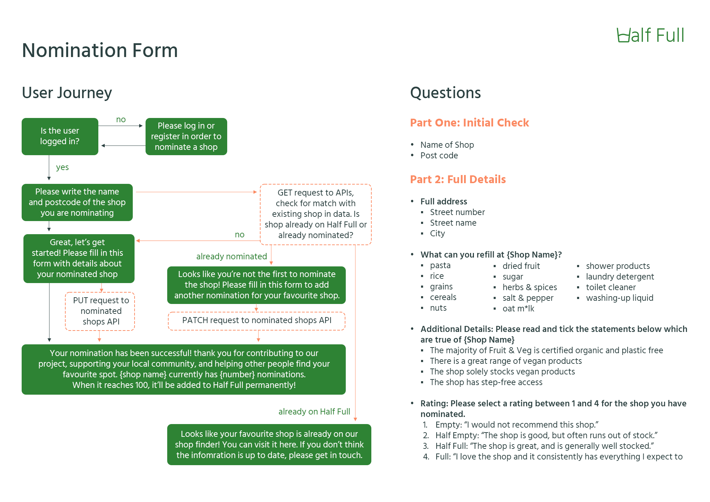
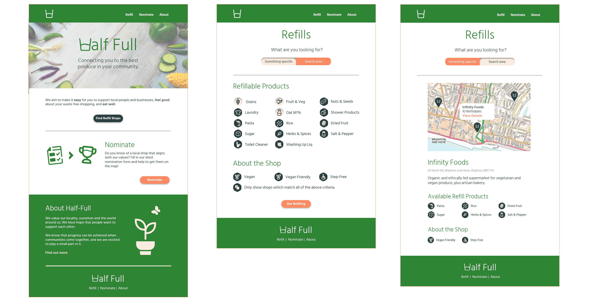

_Please note, this is a work in progress. The site is being created as a 'Capstone' project, as part of a BrainStation Software Engineering Bootcamp. [The Server Repo can be found here](https://github.com/effie-fow/half-full-refills-server)_

# Half-Full Refills

## Overview

**Half Full** refills is the modest store locator connecting you to the best produce and products in your community. We aim to make it easy to support local people and businesses, feel good about your waste-free shopping, and eat well.

### Problem Space

Articulated well by [Shop Local's '10 Reasons Why'](https://shoplocaluk.org/reasons-why/), supporting local businesses recirculates money locally, preserves your community and reduces your carbon footprint.

A range of studies highlighted by [Readability](https://www.readability.co.uk/blog/sustainability-statistics-that-might-shock-you/#:~:text=76%25%20of%20consumers%20choose%20paper,over%20plastic%20for%20environmental%20reasons.) all point to the fact that the majority of UK consumers **want** to shop plastic-free, are willing to pay more for sustainable packaging and "expect brands to act sustainably". And yet, when asked 'where do you regularly buy food and products for everyday use?', 83% of UK respondents said Supermarkets, with only 10% reporting Organic Food Stores ([June 2024](https://www.statista.com/forecasts/997923/grocery-shopping-by-store-type-in-the-uk)).

So we jump to blogs, community boards and Reddit, where shopping local is "too expensive" and "time consuming". In short, people seem to agree that it is a good thing to do, but ultimately don't see sustainable shopping as a sustainable lifestyle. It's not accessible.

At **Half-Full**, we still have hope that this can change. We are not under any illusions that shopping organic and locally can be more time-consuming. But, we believe it's worth it, and believe more people would shop the way we like to if they knew where to go.

Our app celebrates and connects you to your local businesses that provide waste-free shopping. Use our simple filters to find what you're looking for, and get refilling.

Know of a local shop that aligns with our values? Fill in our short nomination form and help to get them on the map!

### User Profile

- Shoppers:
  - who already shop in refill markets
  - looking for shops in a new area
  - who are interested in starting to shop this way

### Features

- As a user, I want to browse refill and/or organic produce shops in a given area
- As a user, I want to know what products are available to refill in the shops
- As a user, I want to know if the shop is well stocked with vegan/plant-based products
- As a user, I want to know the shop has been approved by other users

- As a logged in user, I want to be able to 'nominate' my local shop which isn't already on the system
- As a logged in user, I want to be able to leave an overall rating for listings I nominate

## Implementation

### Tech Stack

- React JS
- Node JS
- MySQL
- Client libraries:
  - react
  - react-router
  - axios
  - express
  - knex
  - sass

### APIs

- Leaflet OR MapBox

### Sitemap

- Home page
- Shops

  - Shops (Browse)
    - Map feature
    - Selected shop cards appear below map
  - Shops (Search)

    - List of refill items for user to select (with strict search / must include optional)
    - Once selected, 'find shops' button brings up list of shops with icons matching your search
    - **Refill Page Plan**

    

- Shop (Individual)
  - Each shop can have it's own page with full details including items available for refill, other information, map, address, link to website,
  - Each shop page should show:
    - Half Full Rating (from Empty to Full)
    - Information not accurate? Let us know \*
- Nominate a Shop

  - Form page where logged in users can fill in essential details about the shop they're nominating
  - **Nomination Form Plan**

    

- Log-in
- Create account

### Mockups

### Data

There will be three core data tables with varying relationships, two intermediate tables and a user table.

1. **shops** - includes key shop details;

   - **Columns**

     - id (PK)
     - name
     - street number
     - street name
     - city
     - postcode
     - latitude
     - longitude
     - is active

   - **Relationships**
     - items - N:N via intermediate
     - nominations - 1:N

   ***

2. **items** - includes item ID and item's name (eg. pasta, oat milk, laundry detergent)

   - **Columns**

     - id (PK)
     - name

   - **Relationships**
     - shops - N:N via intermediate
     - nominations - N:N via intermediate

   ***

3. **nominations** - table to track the details of each nomination submitted by a user

   - **Columns**

     - id (PK)
     - shops_id (FK)
     - users_id (FK)

   - **Relationships**
     - shops - N:1
     - users - N:1
     - nominations - N:N via intermediate

   ***

4. **users** - details of logged in user

   - **Columns**

     - id (PK)
     - nominations_id (FK)
     - name
     - email

   - **Relationships**
     - nominations - 1:N

   ***

   

### Endpoints

- **GET - /shops**

  Full list of shops

  https://halffullapi.com/shops?api_key={apiKey}

  - Params

    - ?match_type={"exact" or "partial"} = defines whether all items queried must be included in results, or if at least one must be included.

      - baseURL/shops?is-active=1&items=milk,grains,fruit_veg&**match_type=exact**

    - ?items={item} = finds shops by whether or not they have specific items (optional - full list of shops returned if not specified)

      - baseURL/shops?is-active=1&**items=milk,grains,fruit_veg**&match_type=exact

    - ?is_active={1 or 0} = refines list to either 'active' or 'inactive (nominated)' shops (optional - full list of shops returned if not specified)

      - baseURL/shops?**is-active=1**

    - ?city={city name} = refines list to only show shops in the named city

      - baseURL/shops?is-active=1&items=fruit_veg&**city=brighton**

    ***

  - Returns

    _Array of full shop objects_

    - [{...}, {...}, {

      - id: random-shop-id,
      - name: Shop Name,
      - address: {
        - streetNumber: 1,
        - streetName: Random Street,
        - city: City,
        - postCode: AA11 AA1,
        - latitude: 51.5072,
        - longitude: 0.1276,
      - }
      - refills: {
        - pasta: boolean,
        - rice: boolean,
        - grains: boolean,
        - nuts: boolean,
        - driedFruit: boolean,
        - sugar: boolean,
        - herbsSpices: boolean,
        - saltPepper: boolean,
        - showerProducts: boolean,
        - oatMillk: boolean,
        - laundryDetergent: boolean,
        - toiletCleanser: boolean,
        - washingUpLiquid: boolean,
      - }
      - otherInfo: {
        - fruitVeg: boolean,
        - veganAlternatives: boolean,
        - stepFreeAccess: boolean,
        - rating: number(1-4)
      - }

    - }]

---

- **GET - /shops/:id**

  Full shop object

  https://halffullapi.com/shop/:id?api_key={apiKey}

  - Returns

    _Full shop object of individual shop, specified by ID_

---

- **PATCH - /shops/:id**

  Edit single property of object

  https://halffullapi.com/shop/:id?api_key={apiKey}

  - Returns

    _Updated shop object_

---

- **PUT - /shops/:id/nominations**

  Add a nomination for a shop whilst specifying the items it sells. This creates a new nomination row in the _nominations_ table and a new nomination/item row for each item of the nomination in the _nominations_items_ table.

  https://halffullapi.com/shop/:id/nominations

  - Expected body:

    - {
      - users_id: 7,
      - items: ["pasta", "rice", "step_free", "vegan", "oat_milk", "salt_pepper"]
    - }

  - Returns

    - {
      - shopName: "Name",
      - nominatedItems: ["pasta", "rice", "step_free", "vegan", "oat_milk", "salt_pepper"]
    - }

---

- **DELETE - /shops/:id**

  Delete specified shop from database

  https://halffullapi.com/shop/:id?api_key={apiKey}

  - Returns

    _No object_

## Roadmap

- Create core structure for repos (client/server)
- Create Database
  - Finalise db structure
  - Initialise Knex (create tables/migrations & seeds)
- Write API routes/controllers (testing in postman)
- Set up client routes (react router dom)
- Create client pages (first 'round', prioritise functionality over styling). Recommended order:
  - _Nomination Form_
  - _Shop (Individual)_
  - _Shops (Browse)_
  - _Shops (Search)_
  - _Create Account_
  - _Login_
- Add full styling to client pages (in same order as above)
- Add 404 page (and any other error page required)

## Future Implementations

- _"Information not accurate? Let us know"_ \* an additional innacurate data form would be useful in future iterations
- _"Verified as accurate by {number} Half Full users"_ - it would be nice to have a 'verify as accurate' button for logged-in users where they can mark the shop's details as accurate after visiting.
- Embedded Google Reviews
